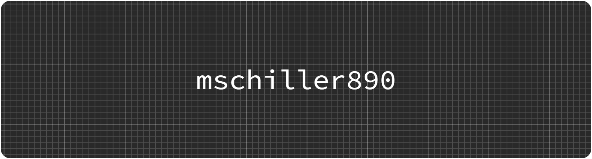

<table> <tr> <td>  </td> <td>  </td> <td>  </td> </tr> </table>

I’m a 16-year-old developer who loves **tech, coffee, and unfinished side projects**.  
I spend way too much time building random stuff in **C#, Java, Python, HTML, CSS, and JavaScript** — and even more time breaking it.

---

## About Me
- I love experimenting with code and making weird little projects just for fun.  
- Always learning something new (currently: probably debugging something that worked yesterday).  
- Big fan of clean code, messy desks, and old tech aesthetics.

---

## Tech Stack
```
╭────────────────┬──────────────────────────────────────────────╮
│ 🧠 Languages     │ C#, Java, Python, HTML, CSS, JavaScript       │
│ 🧰 Tools & IDEs  │ Visual Studio, VS Code, PyCharm, Android Studio│
│ 🌐 Web Dev       │ Node.js, React (learning)                     │
│ 🎨 Style         │ Minimal • Modern • Efficient                  │
╰────────────────┴──────────────────────────────────────────────╯
```

<p align="center">
  
  
  
  
  
  
</p>

---

> _"Build what doesn't exist."_